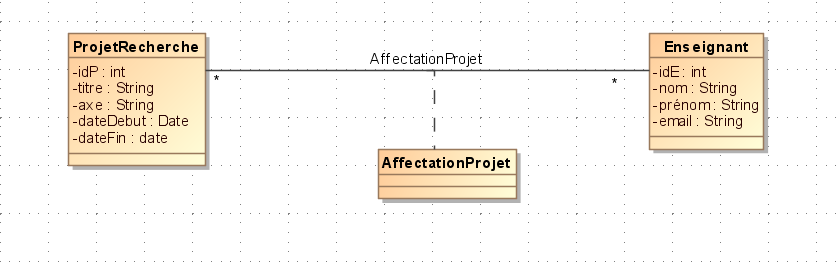
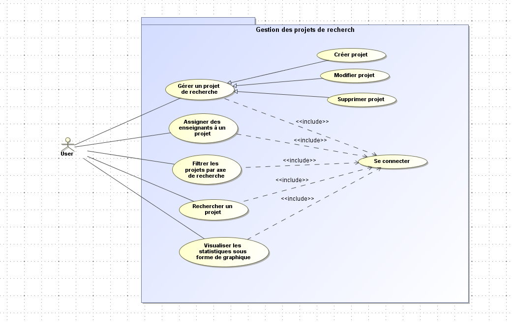
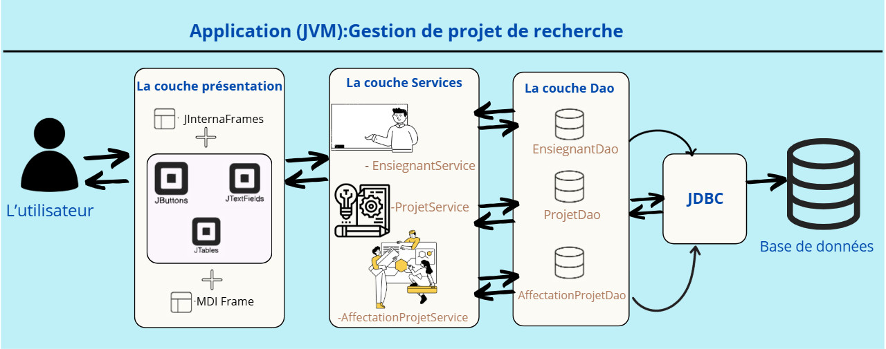

# Gestion des Projets de Recherche


## Contexte


Dans le cadre académique, la gestion des projets de recherche est une tâche complexe qui nécessite une organisation rigoureuse. Les enseignants et chercheurs sont souvent impliqués dans plusieurs projets simultanément, et il est essentiel de pouvoir suivre l'avancement de ces projets, les axes de recherche, et les responsabilités de chacun. Ce projet vise à simplifier cette gestion en offrant une plateforme centralisée pour créer, assigner et suivre les projets de recherche.


---


## Problématique


La gestion des projets de recherche est souvent dispersée et manque de centralisation. Il devient difficile de suivre l'évolution des projets, d'attribuer les enseignants à des projets spécifiques et d'obtenir des statistiques sur les axes de recherche actifs.


---


## Fonctionnalités


L'objectif de ce projet est de développer une application permettant de :


* *Créer* un projet de recherche.

* *Assigner* des enseignants à un projet.

* *Filtrer* les projets selon leur axe de recherche.

* *Rechercher* un projet par titre.

* *Visualiser* la répartition des projets par axe de recherche via un graphique.


---


## Structure de la Base de Données


La base de données MySQL est composée des tables suivantes :


*Les tables :*


1.  *ProjetRecherche* : Contient les informations sur les projets de recherche.

2.  *Enseignant* : Contient les informations sur les enseignants.

3.  *AffecteProjet* : Contient les informations sur les affectations des enseignants aux projets.


*Relations entre les Tables :*


* Un projet (ProjetRecherche) peut avoir plusieurs enseignants assignés via la table AffecteProjet.

* Un enseignant peut participer à plusieurs projets.

* La table AffecteProjet sert de table de liaison pour gérer la relation many-to-many entre ProjetRecherche et Enseignant.


## Schéma de la Base de Données :


```sql

CREATE TABLE ProjetRecherche (

    idP INT AUTO_INCREMENT PRIMARY KEY,

    titre VARCHAR(255) NOT NULL,

    axe VARCHAR(255) NOT NULL,

    date_debut DATE NOT NULL,

    date_fin DATE NOT NULL

);


CREATE TABLE Enseignant (

    idE INT AUTO_INCREMENT PRIMARY KEY,

    nom VARCHAR(100) NOT NULL,

    prenom VARCHAR(100) NOT NULL,

    email VARCHAR(255) NOT NULL UNIQUE

);


CREATE TABLE AffecteProjet (

    id_enseignant INT NOT NULL,

    id_projet INT NOT NULL,

    PRIMARY KEY (id_enseignant, id_projet),

    FOREIGN KEY (id_enseignant) REFERENCES Enseignant(idE) ON DELETE CASCADE,

    FOREIGN KEY (id_projet) REFERENCES ProjetRecherche(idP) ON DELETE CASCADE

);

```

## Le diagramme de classe :



## Le diagramme de Use cases :


---

## L'architecture du projet :


## Technologies utilisées :

Ce projet utilise **Java**, **MySQL** et **Java Swing** pour gérer les projets de recherche et l’affectation des enseignants.  

- **Java** assure la logique métier.  
- **MySQL** stocke les données (utilisateurs, enseignants, projets, affectations) via **JDBC**.  
- **Java Swing** fournit une interface interactive.  

L’architecture suit le modèle **MVC**, avec un système d’authentification et une gestion des dates via `java.sql.Date`, assurant une gestion efficace et intuitive des projets.


## 🎥 Vidéo de Démonstration  
Vous pouvez visionner la vidéo de démonstration ici :  


https://github.com/user-attachments/assets/796b3448-ec95-478c-bd14-eefaad660585


"# Gestion-des-projets-de-recherche" 

